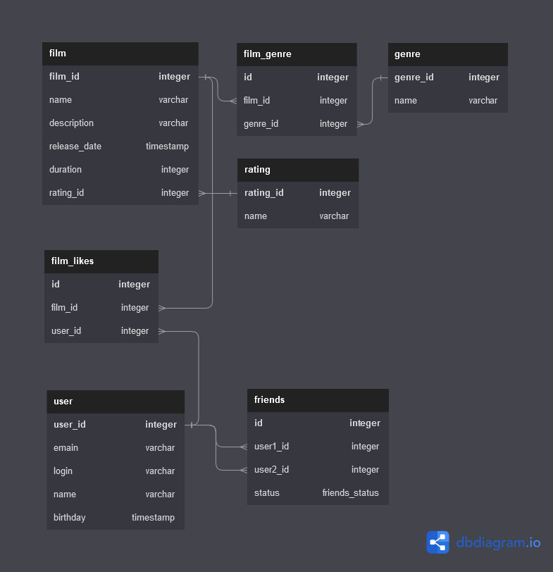

# java-filmorate
Template repository for Filmorate project.

## ER-диаграмма БД проекта



Жанры фильмов, которых может быть много, лайки пользователей и друзья вынесены в отдельные таблицы, для соответствия третьей нормальной форме.

### Примеры запросов, которые могут понадобится при такой структуре:
* Выборка имен фильмов с их жанрами и рейтингами
```sql
SELECT 
  f.name, 
  string_agg(g.name, ', ') AS genres, 
  r.name AS rating 
FROM 
  film AS f 
  LEFT JOIN film_genre AS fg ON f.film_id = fg.film_id 
  LEFT JOIN genre AS g ON fg.genre_id = g.genre_id 
  LEFT JOIN rating AS r ON f.rating_id = r.rating_id 
GROUP BY 
  f.name, 
  r.name
```
* Получение списка 10 самых популярных фильмов
```sql
SELECT 
  f.name, 
  COUNT (fl.id) AS likes 
FROM 
  film AS f 
  LEFT JOIN film_likes AS fl ON f.film_id = fl.film_id 
GROUP BY 
  f.name 
ORDER BY 
  likes DESC 
LIMIT 
  10;
```